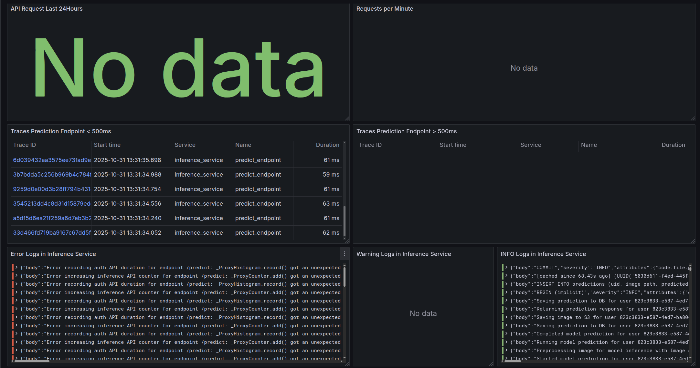
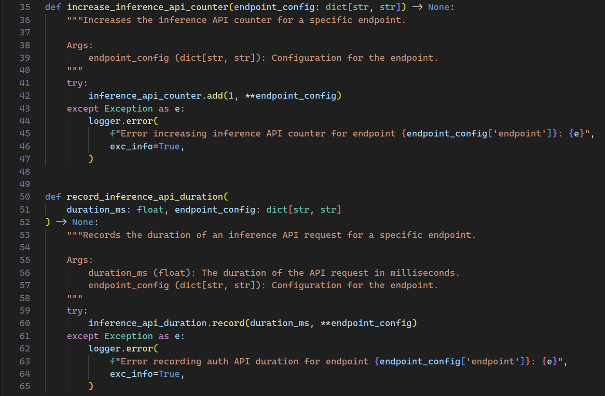
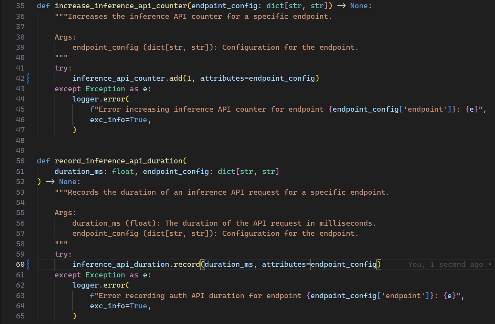
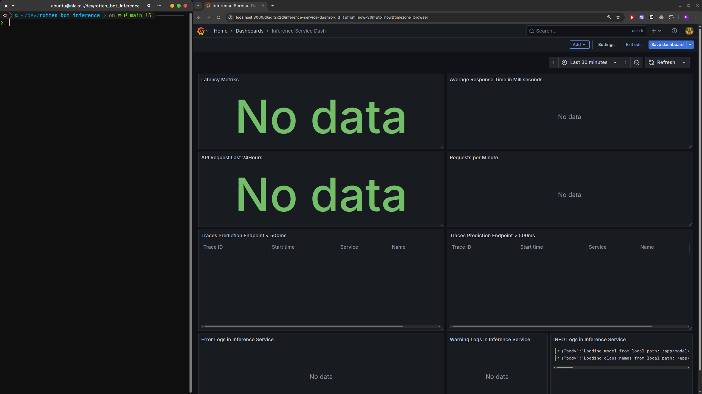
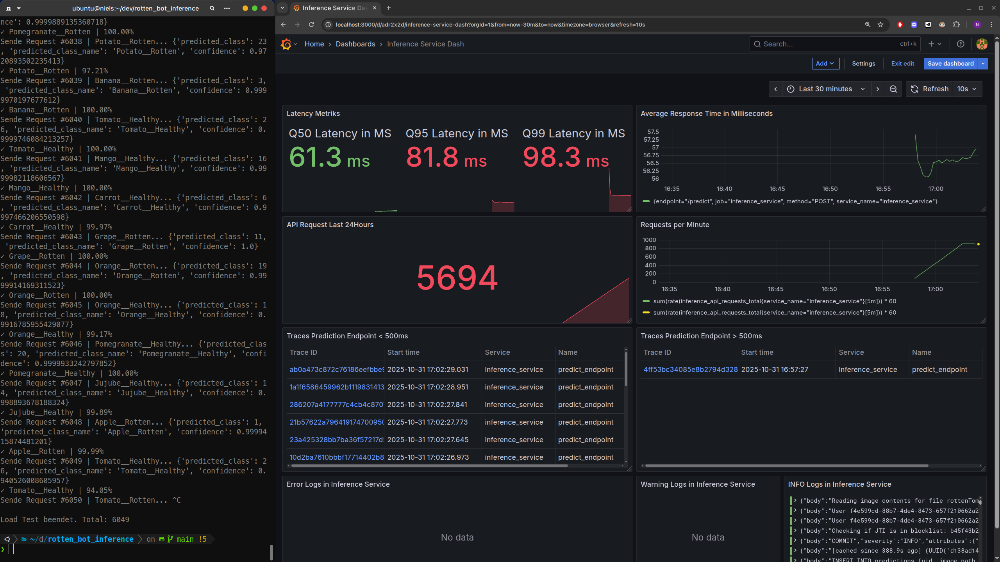
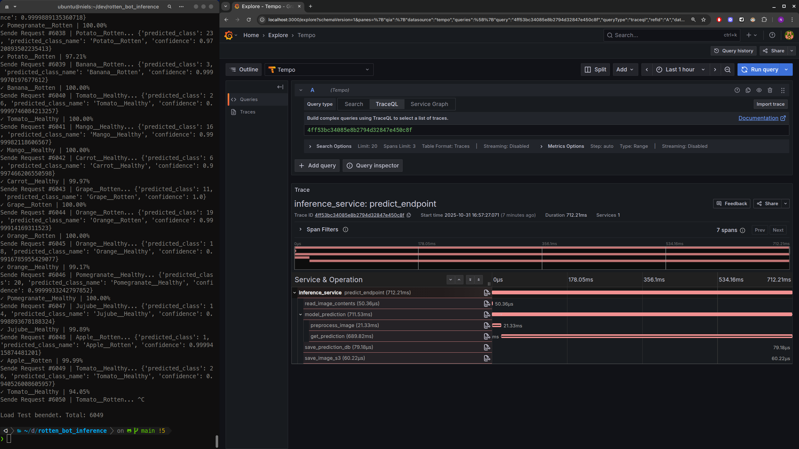
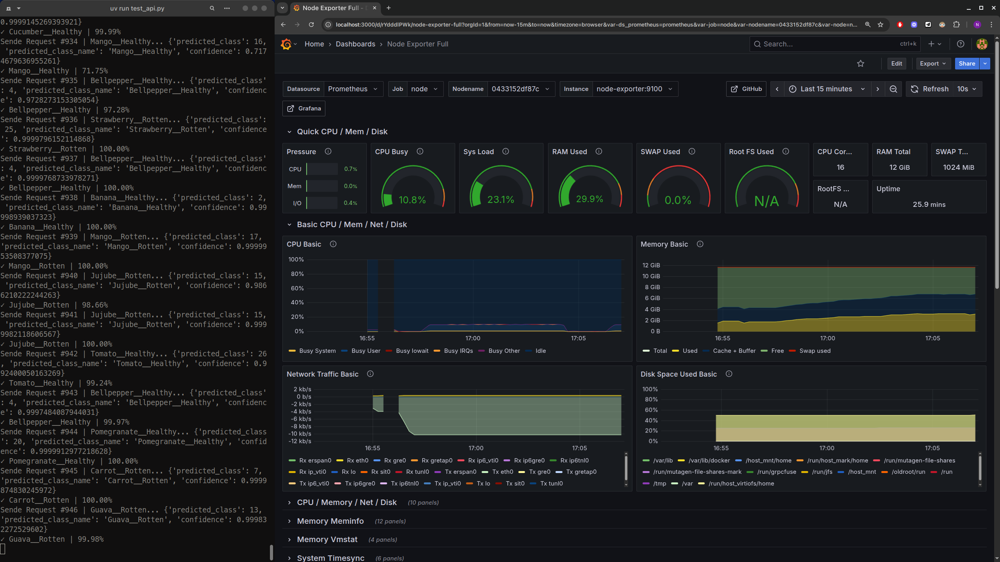

# RottenBot 🍎🤖

<div align="center">

**A robust, extensible Deep Learning system for image classification with comprehensive observability**


</div>

---

## 🎯 Project Overview

**RottenBot** is a Machine Learning system for **classifying healthy vs. rotten fruits and vegetables** (28 classes). The project demonstrates ML development best practices with focus on:

- ✅ **Reusability** - Components can be reused for any image classification task
- ✅ **Maintainability** - Clear structure and comprehensive documentation
- ✅ **Scalability** - Microservice architecture for independent scaling

---

## 🏗️ Architecture

RottenBot consists of **13 services** organized into four main categories:

### 🔬 ML & Application Services (4 Services)

#### 1. [RottenBot_ExpTracking](https://github.com/niels-2005/RottenBot_ExpTracking)
**Experiment Tracking & Model Training**

MLflow-based framework for reproducible model training and versioning.

#### 2. [RottenBot_AuthService](https://github.com/niels-2005/RottenBot_AuthService)
**Authentication & Authorization**

JWT-based authentication service with PostgreSQL and Redis.

#### 3. [RottenBot_InferenceService](https://github.com/niels-2005/RottenBot_InferenceService)
**ML Model Inference**

High-performance FastAPI service for real-time image classification.

#### 4. [RottenBot_Frontend](https://github.com/niels-2005/RottenBot_Frontend)
**Web Interface**

Streamlit-based demo UI for user registration, user login and image classification.

---

### 🗄️ Database Layer (3 Services)

| Service | Description |
|---------|--------------|
| **PostgreSQL** | Relational database for user accounts and ML predictions |
| **Redis** | In-memory store for JWT token blacklisting |
| **MinIO** | S3-compatible object storage for image archival |

---

### 📊 Observability Stack (5 Services)

| Service | Description |
|---------|-------|
| **Grafana** | Central visualization platform for metrics, logs & traces |
| **Prometheus** | Time-series database for metrics (latency, request count, etc.) |
| **Loki** | Log aggregation system for structured logs |
| **Tempo** | Distributed tracing backend for request tracing |
| **Node Exporter** | Host metrics collector (CPU, memory, disk, network) |

---

### 🔄 Telemetry Collector (1 Service)

| Service | Description |
|---------|--------------|
| **Alloy** | Grafana OpenTelemetry Collector - collects and routes logs, metrics & traces |

---

## 🚀 Quick Start

### Prerequisites

- Docker & Docker Compose (or just Docker Desktop)
- at least 6GB RAM available

### Installation & Start

1. **Clone the repository**
   ```bash
   git clone https://github.com/niels-2005/RottenBot.git
   cd RottenBot
   ```

2. **Configure environment variables**
   ```bash
   cp .env.example .env
   ```

3. **Start the system**
   ```bash
   docker-compose up -d
   ```

### 🌐 Service URLs

| Service | URL | Description |
|---------|-----|--------------|
| Frontend | http://localhost:8501 | Streamlit Web UI |
| Grafana | http://localhost:3000 | Dashboards (Credentials in .env) |
| MinIO Console | http://localhost:8998 | Object Storage UI (Credentials in .env) |

---

## 📊 Observability & Monitoring

The Inference and Auth Service are instrumented with **OpenTelemetry** and send traces, logs, and metrics to **Alloy**. Alloy then forwards them to **Tempo** for traces, **Loki** for logs, and **Prometheus** for metrics:

### Traces in Tempo

- 🔍 End-to-end request tracking across service boundaries
- ⏱️ Latency breakdown (DB queries, model inference, etc.)
- 🐛 Error tracking with stack traces
- 📈 Performance bottleneck detection

### Metrics in Prometheus

Key Performance Indicators (KPIs):

- **Request Duration** - P50, P95, P99 latencies
- **Request Count** - Throughput per endpoint
- **System Metrics** - CPU, memory, disk I/O (via Node Exporter)

### Logs in Loki

Structured logs from all services, for example:

```python
logger.info(f"User {user_uid} requested prediction")
logger.warning(f"Invalid file type: {content_type}")
logger.error(f"Prediction failed: {error}", exc_info=True)
```

### Grafana Dashboards

Pre-configured dashboards for:

- 📊 API Performance (latency, throughput, error rate)
- 🖥️ System Health (CPU, memory, network)
- 🔍 Distributed Traces (request flow visualization)
- 📝 Log Analysis (error patterns, user activity)

---

## Why Observability Matters: A Real-World Example

When I finalized my project, I encountered a critical issue that perfectly demonstrates why comprehensive observability is essential for systems.

### The Problem

The Inference Service appeared to work perfectly from the user's perspective - predictions were successful and the API responded normally. However, there was a bug preventing metrics from being sent to Alloy, which meant they weren't reaching Prometheus and couldn't be visualized in Grafana.

**Critical developer metrics were missing:**
- P50, P95, P99 latency percentiles
- Requests per minute
- Average response time in milliseconds
- General API request counts

### Dashboard Error Visualization



### The Root Cause

The bug was in the metrics instrumentation code. In lines 42 and 60, I was incorrectly passing `**endpoint_config` instead of `attributes=endpoint_config` when creating metrics.



### The Fix

By changing `**endpoint_config` to `attributes=endpoint_config`, the metrics could once again be properly sent to Alloy and visualized in Grafana.



### The Impact

Without proper observability, I would have had to manually debug why metrics weren't appearing in Grafana. Instead, the error logs in the Inference Service (visible in the bottom-left of the dashboard) immediately showed that metrics couldn't be sent to Alloy.

**This incident highlights why observability is crucial:**
- ✅ **Immediate Issue Detection** - Problems are visible before they become critical
- ✅ **User Experience vs. System Health** - Service works for users but metrics reveal underlying issues
- ✅ **Rapid Debugging** - Error logs pinpoint the exact problem location

---

## ⚡ API Load Testing: Performance Under "Real-World" Conditions

To validate the system's performance capabilities, I conducted comprehensive load testing using the observability stack to monitor every aspect of the system's behavior.

### Before Load Testing

The Grafana dashboard before load testing - only showing server startup logs, no metrics, traces, or user activity yet.



### Automated Load Testing Script

I built a custom script that automatically selects diverse images from the test dataset and sends them to the Inference Service. This simulates real-world usage with varied image content rather than repetitive requests with the same image.

### Load Test Results

After running the load test for approximately 5 minutes, the results were:



**Key Performance Metrics:**
- **Total Requests:** 5,694 API calls in ~5 minutes
- **P99 Latency:** 98.3ms (99% of requests faster than 98.3ms!)
- **Peak Throughput:** 900 requests per minute (15 images/second)
- **Note:** All testing conducted on localhost with no network overhead

### Deep Dive: Analyzing Slow Traces

One particular trace stood out - taking over 500ms, which is significantly slower than the P99 latency. Let's examine it:



In the red-highlighted section, we can see the `model_prediction` span containing:
- `preprocess_image` span (duration: 21.33ms)
- `get_prediction` span (duration: 689.80ms)

### Root Cause Analysis: Cold Start Problem

After debugging, I discovered this was the very first request to the service - a classic **cold start issue**. The model needed to be loaded into memory, causing the initial prediction to be significantly slower.

**Possible Solution:** Pre-warm the service by classifying 2-3 images before making it available to users. This ensures the model is loaded and ready for optimal performance.

Without this observability stack, identifying and resolving the cold start issue would have been significantly more difficult or may have never been addressed.

### Host System Metrics

The Node Exporter service provides comprehensive host-level monitoring:



## Key Learnings

Throughout the development of RottenBot, I gained valuable insights and skills across various domains:

- **TensorFlow Model Training and Best Practices** - Deepened understanding of efficient model training workflows and optimization techniques
- **MLflow Experiment Tracking** - Mastered experiment versioning, enabling auditing and reproducibility even years later
- **FastAPI Backend Development** - Improved skills in building high-performance, scalable REST APIs
- **Docker & Docker Compose Development** - Enhanced containerization expertise for microservice architectures
- **MinIO Usage** - Learned to leverage AWS S3-compatible object storage for local development environments
- **CI/CD Pipelines (GitHub Actions)** - Acquired foundational knowledge of automated deployment and testing workflows
- **PostgreSQL and Redis Development** - Gained experience with relational databases and in-memory caching systems
- **Observability Stack** - Mastered OpenTelemetry, Grafana, Alloy, Loki, Tempo, and Prometheus for comprehensive system monitoring
- **Robust Software Development** - Learned extensive error handling techniques (try-catch blocks) to prevent crashes and ensure reliability
- **And more!** - Numerous additional skills in ML engineering and DevOps practices

## Future Improvements

Since October 31, 2025, this project is no longer actively developed. However, if I were to continue its evolution, I would focus on the following enhancements:

- **Auth Service Caching** - Implement intelligent caching strategies to reduce authentication latency
- **Image Prediction Caching** - Add caching layers for frequently requested predictions to improve performance
- **Data Drift Detection** - Develop mechanisms to detect when user data distributions diverge from training datasets
- **MLOps Integration** - Automate retraining and deployment pipelines triggered by newly labeled images
- **Testing Framework (pytest)** - Adopt comprehensive unit and integration testing (Note: I could have AI-generated tests, but chose to learn manual verification for accuracy)
- **CI/CD Optimization** - Enhance pipelines with pytest integration and Docker image vulnerability scanning
- **Expansion of Experiment Tracking Service** - Extend the MLflow-based framework to support broader experiment tracking capabilities:
  - Add Hyperparameter Tuning integration
  - Add support for PyTorch, scikit-learn, and LLMs to experiment tracking - these would not be related to RottenBot, rather making it a central experiment tracking service
- **TensorFlow Lite Integration** - Deploy models on edge devices for reduced costs, improved security, and lower latency (no inference service needed)
- **Alternative Deployment Strategies** (if edge deployment isn't feasible):
  - API Gateway implementation for better request routing and security, rate limiting, and centralized authentication
  - Kubernetes / Argo CD implementation for container orchestration and GitOps-based deployment automation
- **And probably much more!**

---

##  License

This project is licensed under the MIT License.

This README.md file was written by AI but strictly followed by human review and edits.

---

<div align="center">

**⭐ If you like this project, give it a star on GitHub! ⭐**

</div>
